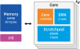

# CV32E40P 4-Core Standalone Verilator Testbench

A standalone testbench for a 4-core CV32E40P cluster.



- 4 CV32E40P cores
- 4MB Shared Memory
- Each core has a 4kB scratchpad memory, each scratchpad memory is accessible by all cores

## Prerequisites

- Verilator in `PATH`
- CORE-V toolchain in `/opt/corev`

## Run

```sh
cd cv32e40p-verilator-cluster4
git submodule update --init --recursive
make run
```

## Pytest

The repository includes a pytest-based smoke test that builds the Verilator model and runs the example applications in `sw/`:

```sh
pytest -v
```

Default app expected output includes:

- `SHARED MEM DEMO PASS sum=10`
- `[TB] CLUSTER EXIT SUCCESS`

Note: stdout characters from 4 cores are written to the same MMIO location and may interleave.

## Low-power wait hint

`sw/cluster_sync.h` supports an optional `wfi` wait hint (`USE_WFI_WAIT=1`).
By default it is disabled for safety because CV32E40P `wfi` can enter sleep if no wake interrupt is configured.

This behavior is documented in CV32E40P sleep docs:

- `cv32e40p/docs/source/sleep.rst`

## Useful targets

- `make firmware` : build `build/fw/shared-memory-demo.elf` and `build/fw/shared-memory-demo.hex`
- `make APP=hello-world firmware` : build an alternate app source from `sw/hello-world.c`
- `make APP=reduction-demo run` : parallel reduction demo
- `make APP=tiled-matmul-demo run` : tiled matrix multiplication demo
- `make APP=barrier-skew-demo run MAXCYCLES=5000000` : barrier stress test with one slow hart and other fast harts
- `make verilate` : compile RTL/testbench with Verilator
- `make run MAXCYCLES=5000000` : run with a custom cycle limit
- `make clean` : remove build artifacts

## Optional waveform dump

Enable VCD tracing by passing `VERI_TRACE=--trace` and enabling `VCD_TRACE` in C++ compile flags, for example:

```sh
make clean
make run VERI_TRACE=--trace VERI_CFLAGS="-O2 -DVCD_TRACE"
```

The waveform file is written to `build/verilator/waves.vcd`.
